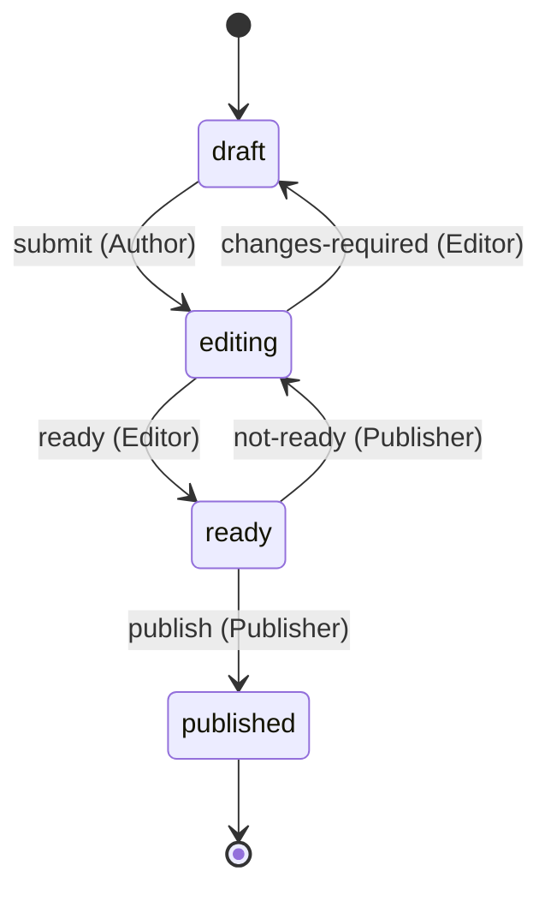
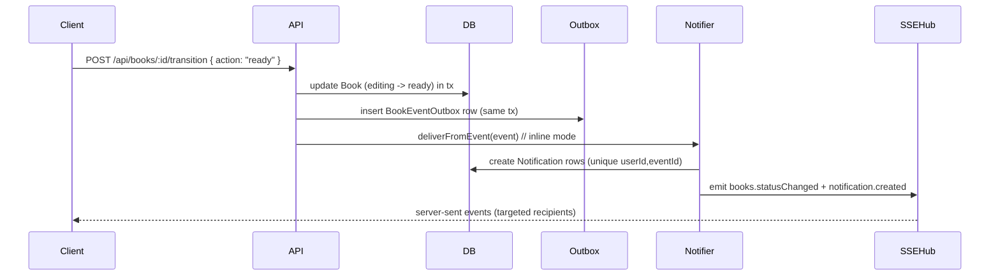

# Manuscript Forge — Architecture

This document gives a concise overview of the domain data model, the book workflow state machine, and the notification delivery path used by Manuscript Forge. Diagrams are rendered with Mermaid for quick at-a-glance understanding.

## ER Diagram
The entities and relations below reflect the current Prisma schema and app logic.

```mermaid
erDiagram
  USER ||--o{ BOOK : "authorId (AuthorBooks)"
  USER ||--o{ BOOK : "editorId (EditorBooks)"
  USER ||--o{ BOOK : "publisherId (PublisherBooks)"
  USER ||--o{ REVIEW : "readerId"
  BOOK ||--o{ REVIEW : "bookId"
  USER ||--o{ NOTIFICATION : "userId"
  BOOK ||--o{ NOTIFICATION : "bookId"

  USER {
    string id PK
    string email
    string name
    enum   role "Author|Editor|Publisher|Reader"
  }

  BOOK {
    string   id PK
    string   authorId FK
    string   title
    text     content
    enum     status "draft|editing|ready|published"
    string   editorId FK?      // nullable
    string   publisherId FK?   // nullable
    datetime createdAt
    datetime updatedAt
  }

  REVIEW {
    string   id PK
    string   bookId FK
    string   readerId FK
    int      rating "1..5"
    text     body
    datetime createdAt
    UNIQUE (bookId, readerId)
  }

  NOTIFICATION {
    string   id PK
    string   userId FK
    string   bookId FK
    string   type     // e.g., BookSubmitted|BookReady|BookPublished...
    string   title
    text     body
    datetime createdAt
    datetime seenAt?
    datetime readAt?
    string   eventId  // idempotency key
    UNIQUE (userId, eventId)
    INDEX(userId, readAt, createdAt)
  }

  %% Note: Outbox has no bookId FK; bookId is carried in payload if needed
  BOOK_EVENT_OUTBOX {
    string   id PK
    string   type      // domain event name
    json     payload
    datetime occurredAt
    datetime processedAt?
  }
```

Note: The outbox does not store a `bookId` FK column; the book id is carried inside `payload`. Notifications use `readAt`/`seenAt` timestamps (no boolean `read`).

## State Diagram
Book workflow with role-guarded transitions.



## Notification Flow (Sequence)
Inline (single-process) delivery for a typical transition (e.g., Editor marks Ready).



In worker mode, the API writes only to Outbox; a background loop reads unprocessed rows, creates notifications, emits SSE, and marks events processed. In a production scale-out, publish Outbox events to SNS and fan out via SQS consumers per channel (add DLQs, retries, idempotency by `eventId`).

## Interfaces & Contracts
- Transition config: centralized map `{ action, from, to, allowedRoles, ownership, notify, outboxType }` consumed by the transition service to enforce legal moves.
- Transition request DTO: `{ action: 'submit'|'changes-required'|'ready'|'not-ready'|'publish' }` (validated with Zod).
- Book create/update DTOs: `{ title, content }` with Zod validation; invalid input returns 400.
- Event payload: `{ eventId, type, bookId, actorId, from, to, occurredAt }` written to Outbox; used by inline/worker delivery; idempotency via `eventId`.
- Notification contract: `{ userId, bookId, type, title, body, createdAt, eventId }` with uniqueness `(userId, eventId)` and index `(userId, readAt, createdAt)`.
- Auth user shape: `{ id, email, name?, role }` from `requireUser/optionalUser`.
- Public vs protected reads: unauthenticated reads allowed only for published content; all mutations require RBAC.
